# DLP Lab5

## Introduction
In lab5, we try to implement the MaskGIT model to perform inpainting on images. The MaskGIT model takes an image with a mask as input and outputs the inpainted image. 

The model consists of two parts: the VQVAE and the Bi-directional Transformer. First, the VQVAE is used to encode the image into a discrete latent space, known as the visual tokens. Then, the Bi-directional Transformer is predict the masked visual tokens. The predicted masked visual tokens are then decoded back to the image space with the decoder in the VQVAE to obtain the inpainted image. 

The model is trained with the Masked Visual Token Modeling (MVTM). 
During the training process, the visual tokens are randomly masked. The model is trained to predict the masked visual tokens with cross-entropy loss. 
During the inference process, the model iteratively predicts the masked visual tokens and updates the masked visual tokens. The tokens and masks are updated with a mask scheduling function. The scheduling function controls the ratio of masking during each iterations. There are three types of scheduling functions: cosine, linear, and square. According to the authors, the cosine scheduling function provides the best results. 

Finally, the FID score is used to evaluate the inpainting performance of the model.

## Implementation details
### Multi-head Self-Attention
The Q, K ,V are supposed to be split into multiple copies for each heads. But, for simplicity, we can concatenate the Q, K, V for all heads, then split them into multiple heads later. This makes the implementation similar to the easier single-head self-attention.

The multi-head self-attention is implemented with the following steps:
First, the x is passed through the linear layers to obtain the query (Q), key (K), and value (V).
Now, the Q, K ,V are of shape `batch_size x num_tokens x dim`. The `permute_QKV_for_multi_head` function reshapes them into `batch_size x num_heads x num_tokens x head_dim` for scaled dot-product attention calculation.

The scaled dot-product attention first multiplies Q and K, scales the result with `1/sqrt(head_dim)`.
Then, the scaled QK is multiplied with V to obtain the attention scores. The attention scores are then reshaped back to `batch_size x num_tokens x dim` and passed through the linear layer to obtain the output.

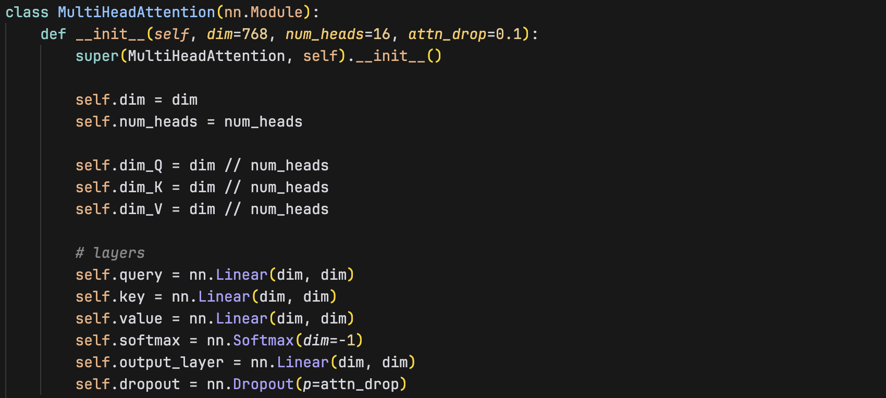

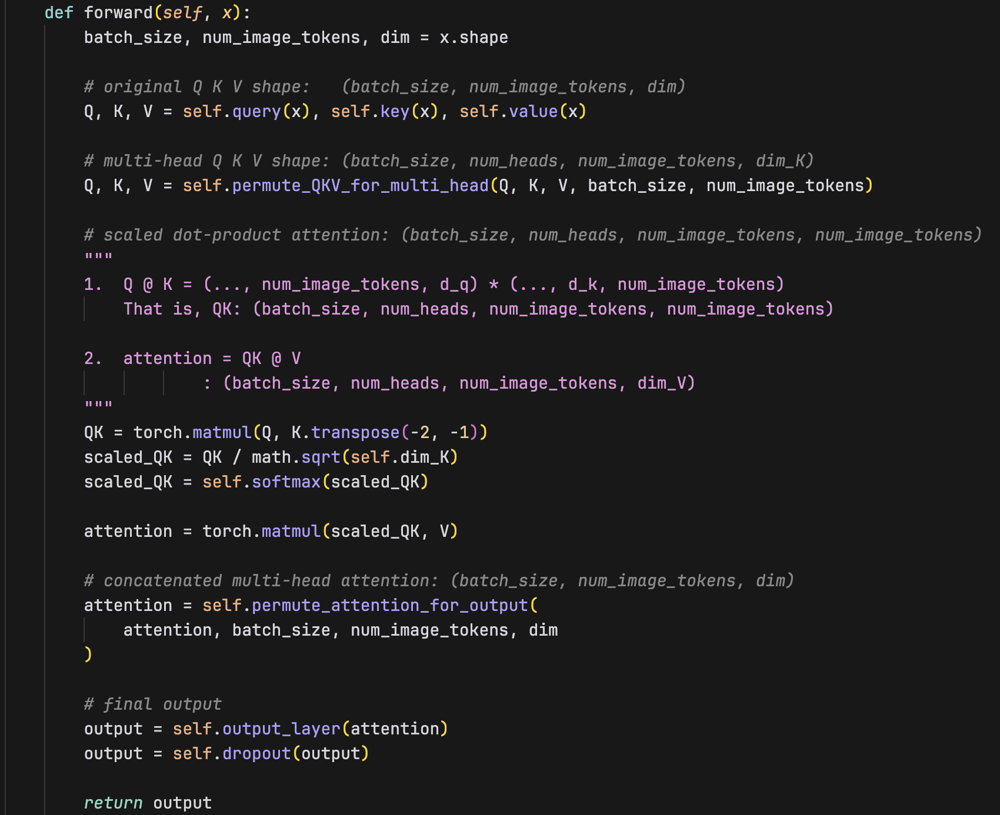

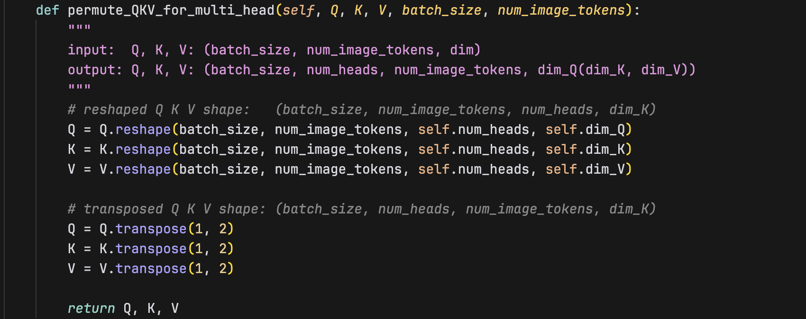

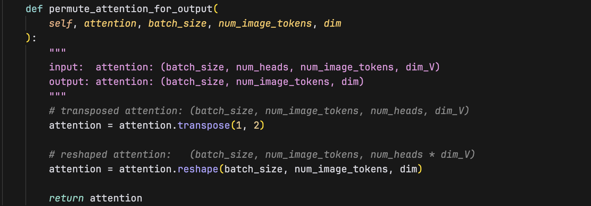

### Training of Masked Visual Token Modeling (MVTM)
To train the MaskGIT (VQGAN+Transformer) model, the model learns to predict the randomly masked visual tokens with the bi-directional transformer. The loss is calculated with the cross-entropy loss between the predicted masked visual tokens and the ground truth masked visual tokens.

#### MaskGIT model
The model takes the image x as input. First, x is encoded to a latent space and quantized to a discrete variable. This is done through the pre-trained VQVAE model. The quantized latent space is the visual tokens. 
Then, a random mask is used to mask the visual tokens. By setting their token values to 1024, 1024 represents a special value to be predicted in the bi-directional transformer.

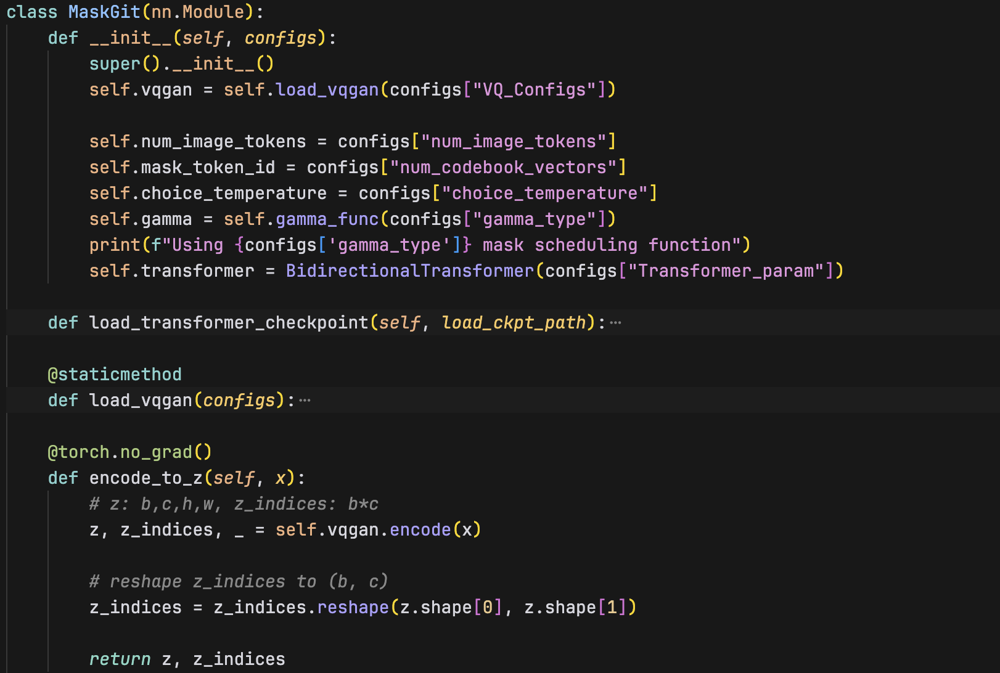

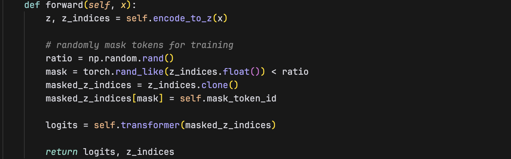

#### Training script
The training process uses AdamW optimizer and StepLR scheduler.

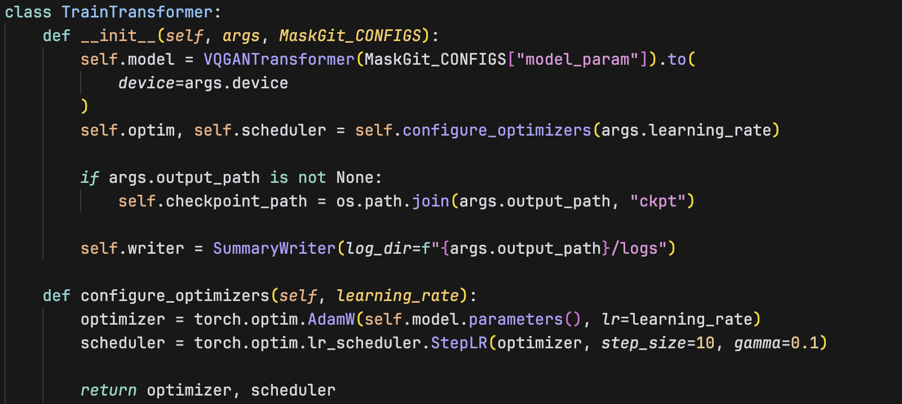

To train one epoch, the image is passed through the model to obtain the predicted masked visual tokens. The z_indices, which is the ground truth of the visual tokens, is also returned by the model. Then, the cross-entropy loss is calculated between the predicted masked visual tokens and the ground truth masked visual tokens. The loss is backpropagated to update the model parameters.
The evaluation process follows a similar process.

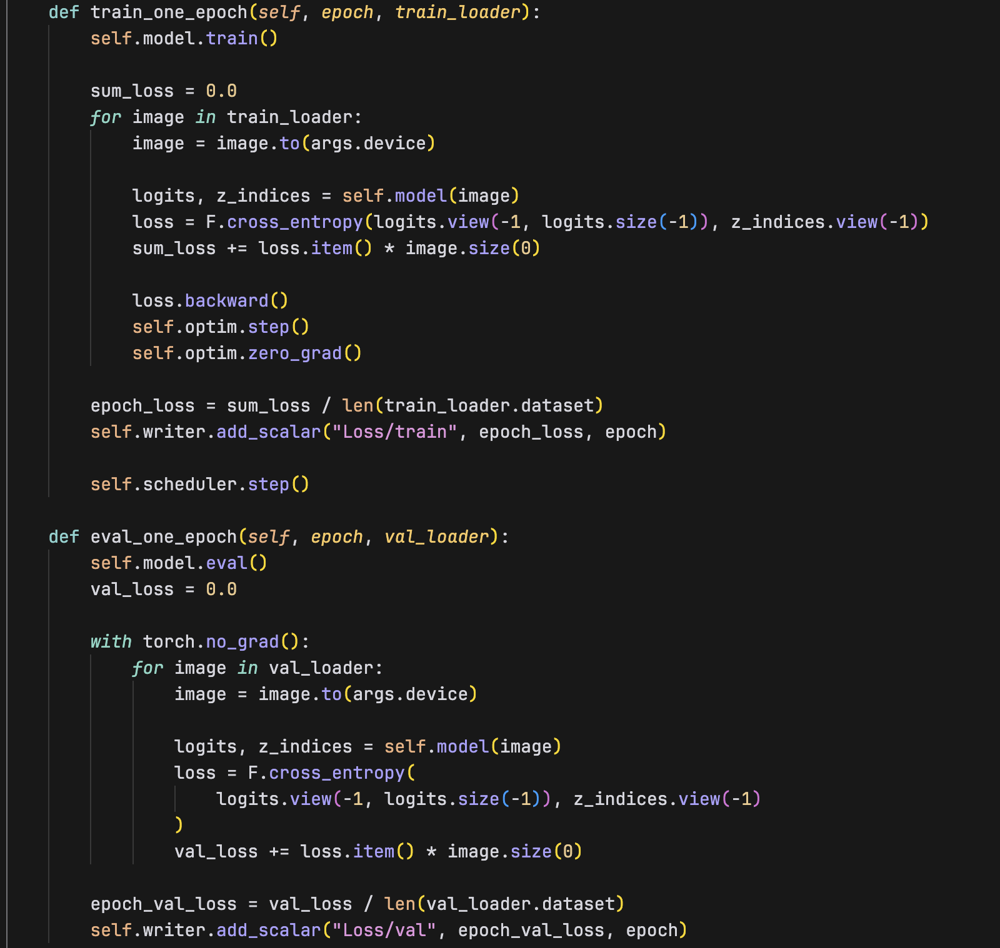

### Inference of Masked Visual Token Modeling (MVTM)
#### Inference script
The inference process is defined in the `MaskGIT` class in `inpainting.py`.
First, the initial image is normalized using the empirical values from the ImageNet settings. Then the process of iterative decoding begins.
In the decoding process, the image is first encoded to the visual tokens and then masked with the current mask. For each step, the `t/T`, predicted tokens, current mask, and the initial mask number are passed to the `model.inpainting` function. The model uses a mask scheduling function to determine at `t/T` step, how many tokens should be masked. The mask scheduling function will be discussed in the next section.

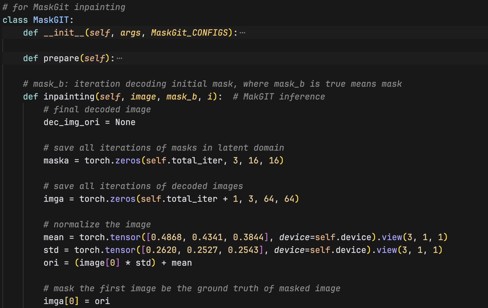

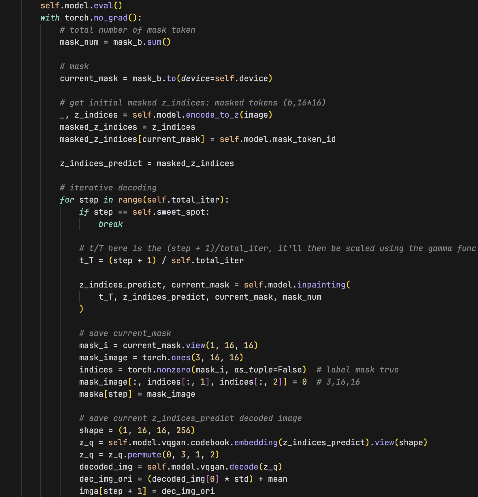

#### Inference and mask scheduling function
Inside the `model.inpainting` function, the model first masked the current visual tokens with the current mask. Then, the transformer is used to predict the values of the masked visual tokens.

The model prediction is then passed through the softmax layer to obtain the probability of each token. The highest probability token is selected as the predicted token.

Then, the mask scheduling function is used to determine the number of tokens to be masked at current step. 
The `t/T` step is passed into the `gamma` function to obtain the mask ratio. The mask scheduling function can be cosine, linear, or square.

Also, the temperature annealing along with the gumbel noise are added to the predicted probability of the tokens to introduce randomness and encourage diversity in the prediction.

Then, the confidence of the unmasked tokens is set the `-inf` to prevent the tokens to be selected and updated.
Then confidence of the predicted tokens can now be sorted in descending order. The highest tokens will be selected to update the current visual tokens.

Next, the number of new predictions available for update in the current step is calculated.

Finally, the mask is updated, indicating the use of newly predicted tokens in the subsequent steps.

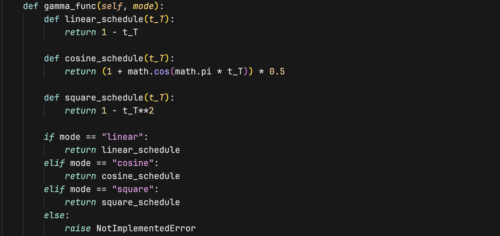

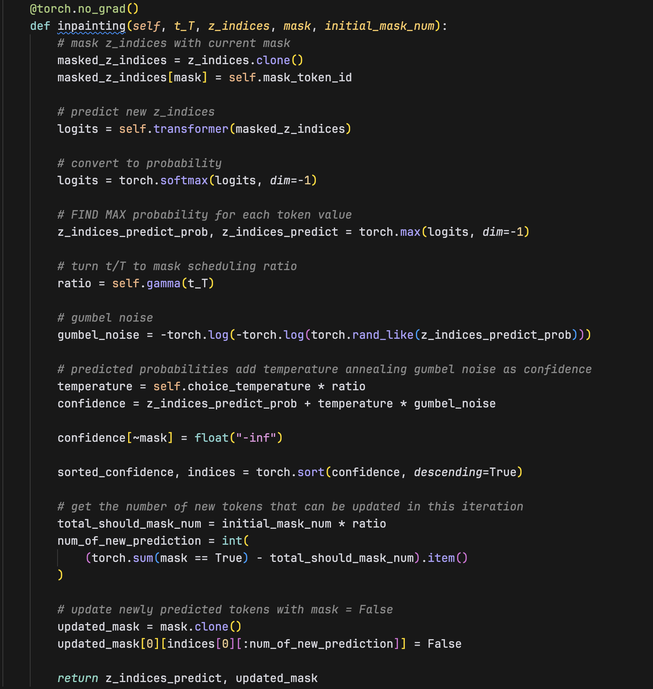

## Experimental results
### Best testing FID score
The best testing FID score is 36.29. 
The sweet spot is set to 6, the total iteration is 12, and the ***cosine*** mask scheduling function is used.

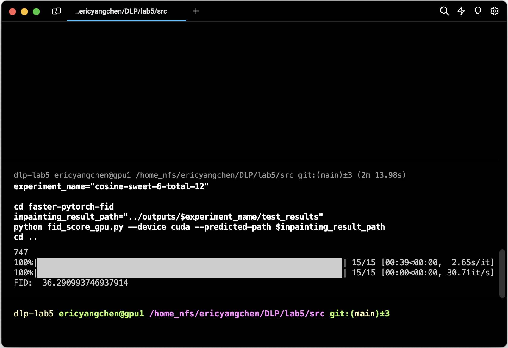

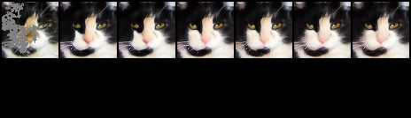

### Comparison of different mask scheduling functions
All of the following inferences use the same sweet spot of 6 and total iteration of 12.
I randomly pick out two images to visualize:

**test-0**
1. Cosine mask scheduling function

2. Linear mask scheduling function
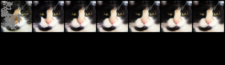

3. Square mask scheduling function
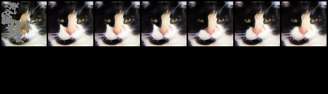

**test-46**
1. Cosine mask scheduling function
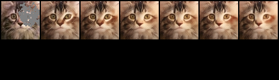

2. Linear mask scheduling function
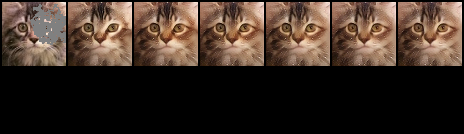

3. Square mask scheduling function
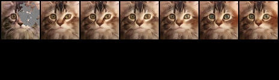

I didn't observe significant differences between the three mask scheduling functions. 
The cosine mask scheduling function seems to have a slight advantage in terms of the FID score.

## Discussion
So far, the best FID score comes from the model using cosine mask scheduling function and sweet spot = 6, total iteration = 12.

However, I also tried not using any iterative decoding (i.e., sweet spot = 1, total iteration = 1).
The result is quite surprising. Without iterative decoding, the model actually achieves the best FID score of 34.40. This makes me wonder if the iterative decoding process is actually necessary for the model to perform well. It may be that our dataset is relatively small (`64x64`), so the benefit of iterative decoding is not apparent in this case.

Since the original MaskGIT paper did not conduct experiments on this setting, I can only speculate that the iterative decoding process may not be necessary for small datasets.

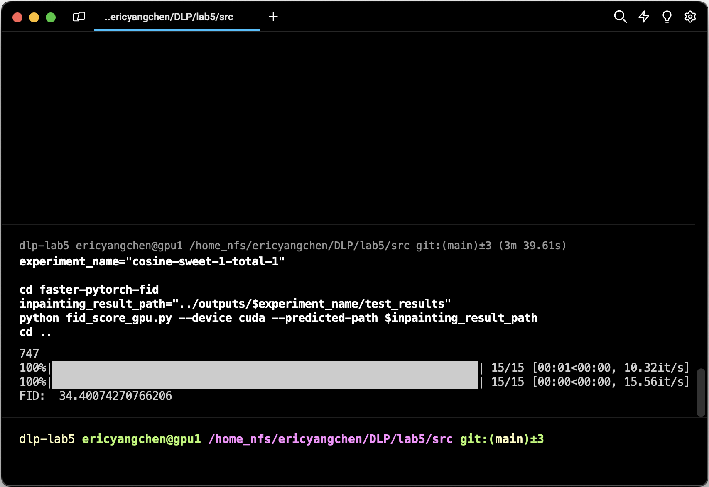
